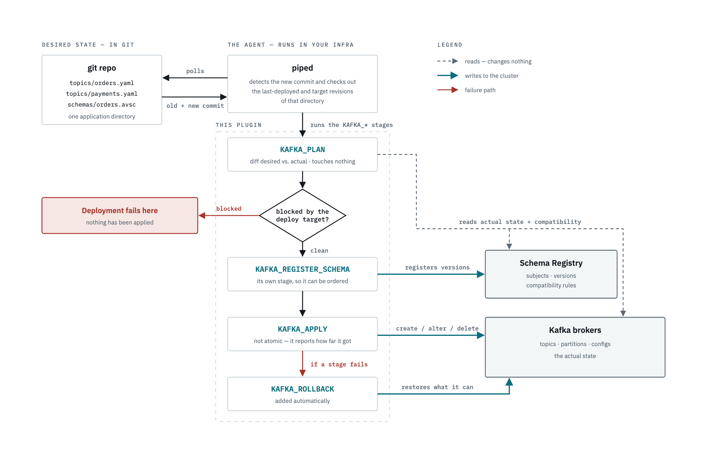

# pipecd-kafka-plugin

A [PipeCD](https://pipecd.dev) deployment plugin that manages **Kafka topics and schemas as a deploy
target**. Topic definitions and Avro/Protobuf schemas live in git; piped plans the difference against
the real cluster, checks schema compatibility with the registry, and applies it.

Built on [`piped-plugin-sdk-go`](https://github.com/pipe-cd/piped-plugin-sdk-go) for the
plugin-arched piped (`pipedv1`).

**New here?** [`docs/GETTING_STARTED.md`](docs/GETTING_STARTED.md) walks through running this against
a real PipeCD control plane and a real Kafka cluster on your own machine, end to end.

## How it works

PipeCD is pull-based. An agent called **piped** runs in your infrastructure and watches a git repo;
nothing ever gets pushed to it. This plugin is what piped calls when an application's pipeline
reaches a `KAFKA_*` stage.



| Stage | What it does |
| --- | --- |
| `KAFKA_PLAN` | Diffs desired against actual, checks schema compatibility, reports the plan. Fails if anything is blocked. Changes nothing. |
| `KAFKA_REGISTER_SCHEMA` | Registers the new schema versions in the plan. |
| `KAFKA_APPLY` | Creates, updates and deletes topics to match the desired state. |
| `KAFKA_ROLLBACK` | Added automatically. Restores the previously running state as far as Kafka allows. |

Three things fall out of that shape:

- **The diff is between commits, not files you edited.** piped checks out the application directory at
  the *previously deployed* commit and at the *target* commit, and the plugin diffs those two. Several
  merges piled up since the last deploy show up as one plan, not one PR at a time.
- **`KAFKA_PLAN` runs before anything is touched.** It reads the real cluster and the real registry,
  classifies every change by whether it's reversible, and fails the whole deployment if it contains an
  irreversible operation the deploy target hasn't explicitly permitted (`allowPartitionIncrease`,
  `allowTopicDeletion`). See [`plan/change.go`](plan/change.go) for what counts as reversible and why.
- **Schema registration is its own stage.** It's kept separate from applying topic changes so you can
  order it against a service rollout in the pipeline, for instance registering a backward-compatible
  schema before consumers update.

## Drift detection

Between deployments, piped periodically asks the plugin what's actually on the cluster. The plugin
answers with two things: the live state, and whether it still matches the repository.

The drift answer is the *same plan* `KAFKA_PLAN` would build. A plan that would change nothing means
synced; anything else is drift, including changes the deploy target would refuse to apply — the
cluster still differs from git, and a deployment wouldn't close the gap on its own. Deciding it this
way means the drift badge and the plan stage can't disagree with each other.

The live state lists the topics this application owns, with their partition count, replication factor
and dynamic configs, and each topic's registry subject underneath it:

| Shown as | When |
| --- | --- |
| healthy | The topic exists on the cluster, or the subject has a registered version. |
| unhealthy | Declared in git but missing from the cluster, or a subject that was never registered. |
| healthy, with a note | On the cluster but no longer declared. The topic is fine; the repository is what disagrees. |

Everything here only reads. A topic another application owns is left out, and a cluster whose
registry is briefly unreachable reports *unknown* rather than a false drift alarm. Set
`driftDetectionEnabled: false` on a deploy target to skip the comparison and report only the live
state.

## Configuration

### Deploy target:

The safety rails live on the deploy target, not on the application. The same application config gets
deployed to staging and to production, so a rail defined per application would travel with the change
into production.

```yaml
plugins:
  - name: kafka
    port: 7020
    url: https://github.com/niladrix719/pipecd-kafka-plugin/releases/download/v0.1.0/plugin_kafka_v0.1.0_linux_amd64
    deployTargets:
      - name: prod
        config:
          bootstrapServers: ["b1.prod:9092", "b2.prod:9092"]
          tls:
            enabled: true
          sasl:
            mechanism: SCRAM-SHA-512
            username: piped
            passwordFile: /etc/piped/kafka-password
          schemaRegistry:
            url: https://registry.prod:8081
          allowTopicDeletion: false
          allowPartitionIncrease: false
          protectedTopics: ["__*", "*.dlq"]
```

| Field | Default | Description |
| --- | --- | --- |
| `bootstrapServers` | required | Broker addresses. |
| `clientID` | none | Identifies this piped in broker logs and quotas. |
| `tls` | disabled | `enabled`, `caFile`, `certFile`, `keyFile`, `insecureSkipVerify`. |
| `sasl` | disabled | `mechanism` (`PLAIN`, `SCRAM-SHA-256`, `SCRAM-SHA-512`), `username`, and `password` or `passwordFile`. |
| `schemaRegistry` | none | `url`, optional `username` and `password`/`passwordFile`, `caFile`. Declaring a schema without this is an error. |
| `allowTopicDeletion` | `false` | Permit deleting topics that are no longer declared. |
| `allowPartitionIncrease` | `false` | Permit raising partition counts. |
| `protectedTopics` | none | Globs this piped must never modify, whatever the application declares. |
| `driftDetectionEnabled` | `true` | Compare live state against desired state outside a deployment. |

### Application:

```yaml
spec:
  plugins:
    kafka:
      topicsDir: topics
      schemasDir: schemas
      ownership:
        - orders.*
        - payments.*
      defaults:
        replicationFactor: 3
        config:
          min.insync.replicas: "2"
```

`ownership` is what makes deletion expressible without being catastrophic. A Kafka cluster is shared
by many applications, and without a scope a plan would look at every topic on the cluster and propose
deleting the ones it has no file for. Topics outside the scope are invisible to this application, and
declaring a topic outside it is an error rather than a silent orphan.

### A topic definition

```yaml
# topics/orders.yaml
name: orders
partitions: 12
replicationFactor: 3
config:
  retention.ms: "604800000"
  cleanup.policy: delete
schema:
  subject: orders-value
  file: orders.avsc      # relative to schemasDir
  compatibility: BACKWARD
```

One file can hold several topics as a YAML stream. A config key that was set and is no longer
declared gets reset to the broker default rather than left behind.

### The schema file

`schema.file` points at whatever the registry accepts, and the plugin sends it verbatim — it never
parses or rewrites it. `schema.type` picks the dialect: `AVRO` (the default), `PROTOBUF` or `JSON`.

```json
// schemas/orders.avsc
{
  "type": "record",
  "name": "Order",
  "namespace": "com.example.orders",
  "fields": [
    { "name": "id", "type": "string" },
    { "name": "customer_id", "type": "string" },
    { "name": "total_cents", "type": "long" },
    { "name": "currency", "type": "string", "default": "USD" }
  ]
}
```

`subject` is the registry key the schema is registered under, and it's yours to name. The convention
most Kafka tooling assumes is `<topic>-value` for record values and `<topic>-key` for keys, which is
why the example above is `orders-value`. Nothing enforces it, but a subject that doesn't follow it
won't be found by consumers using the default naming strategy.

### Stage options

```yaml
- name: KAFKA_PLAN
  with:
    exitOnNoChanges: true    # end the deployment successfully when nothing would change
- name: KAFKA_APPLY
  with:
    continueOnError: false   # stop at the first failure (default), or keep applying independent changes
```

## What a plan looks like

```
Plan: 1 to create topic, 1 to update config, 1 to increase partitions.

  + create topic orders (12 partitions, replication factor 3)
  ~ update config of topic payments (retention.ms: 604800000 -> 2592000000)
  ! increase partitions of topic events from 6 to 12

These changes cannot be undone by a rollback:
  ! increase partitions of topic events from 6 to 12
```

and when something is refused:

```
Blocked (1). Nothing will be applied until these are resolved:
  x the new schema for subject orders-value is not compatible with version 4: reader field 'total' is missing a default value
```

## Local development

```sh
make up       # Redpanda + schema registry + console on localhost
make test     # go test -failfast -race ./...
make build    # build the plugin binary
make down
```

Redpanda is Kafka API compatible and starts in seconds, so you can exercise the code above against a
real broker without paying for a managed cluster. `examples/simple` is a ready-made application
directory. Note that `make up` only starts Kafka; for the full loop with a real control plane and
piped actually running this plugin, use [`docs/GETTING_STARTED.md`](docs/GETTING_STARTED.md).

The test suite needs none of that. The cluster and registry sit behind interfaces, with in-memory
implementations in `provider` that enforce the same rules the real ones do: partition counts only go
up, and a deleted topic is really gone.

## License

[Apache 2.0](LICENSE).
